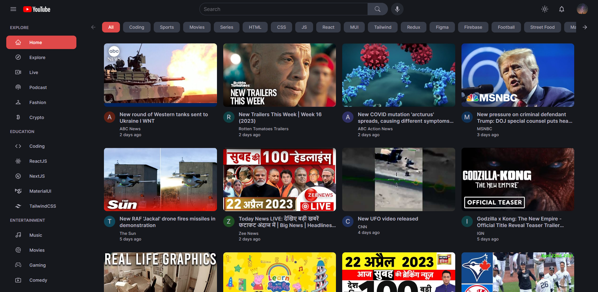

# **YouTube 2.0**

YouTube 2.0 is a modern NextJS application built with various technologies such as Material UI, Rapid API YouTube V3, ContextAPI etc. This application is completely responsive and offers some features such as watch videos, the ability to search videos, dark mode & much more! <a href="https://youtubereplica.vercel.app" target="_blank">Visit</a>

## **ABOUT**

The motive behind creating this project was to make the most of the amazing Rapid API YouTube V3. As the name suggests, this application is a clone of YouTube and it offers some similar features.

## **TOOLS & TECHNOLOGIES USED**
- NextJS
- ContextAPI
- Material UI
- Momemnt JS
- Axios
- React Player
- React Icons
- NProgress